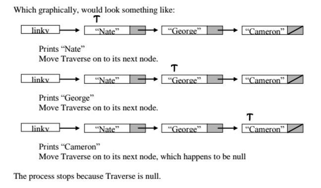

# Linked Lists

## Notes
A Linked List is a dynamic data structure that allows you to create a storage space that is capable of growing or shrinking in size. Additionally, information stored in a Linked List is stored **non-contiguously** and **space is only used as it is needed**. This contrasts a native array, where information is stored contiguously in memory and the size is fixed when instantiated.

A linked list is **a collection of nodes**.

A node typically has two parts:
  1) data (a single String, hash, fixnum, Object, etc...)
  2) a pointer to another node or `nil` (a pointer without a target – essentially goes nowhere)

When we visualize a linked list, our drawings usually look like this:


What you may be wondering is how we can access the data in an individual node of a linked list. **One limitation of a Linked List is that we have to access the data in linear order.** So in order to access data, we must start at the beginning of the list (the "**head**") and move down the list until we run out of nodes, using a **temporary pointer to keep track of our current position in the list**.


So if we had a linked list like the one above, in order to print all the elements in the linked list, we might follow a procedure like:

```
Create variable TRAVERSE to point at the node linky
  WHILE TRAVERSE isn't nil (the end of the linked list)
  Print out the data stored in TRAVERSE's current node.
  Move TRAVERSE to the next node
END WHILE
```



### Different Types of Linked Lists
There are different types of linked lists.

The most basic looks like what is describe above and is called a **singly linked list**. Each node has exactly one successor node, except for the last node, which points to `nil`. Each node has exactly one predecessor node, except for the first node (the "head" or "front" of the list), which has no predecessor.

There are also **doubly linked lists**, which are much like singly linked lists, except that they also point backwards. So doubly linked lists have both a `next` and a `prev` pointer.


There are also **circularly linked lists**, which can either be singly or doubly linked, but the end of the list points back to the first item in the list. In this case, every node has exactly one predecessor and one successor node.


### Inside look at Linked List methods

### Revisiting Interface vs Implementation

### Sorting a Linked List

### Reversing a Linked List
